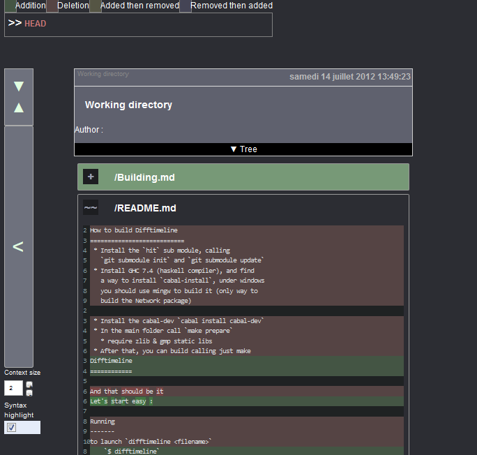
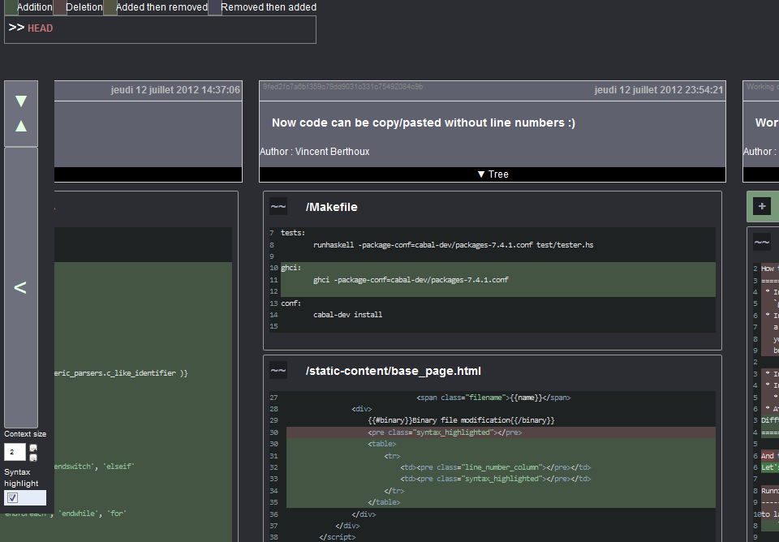
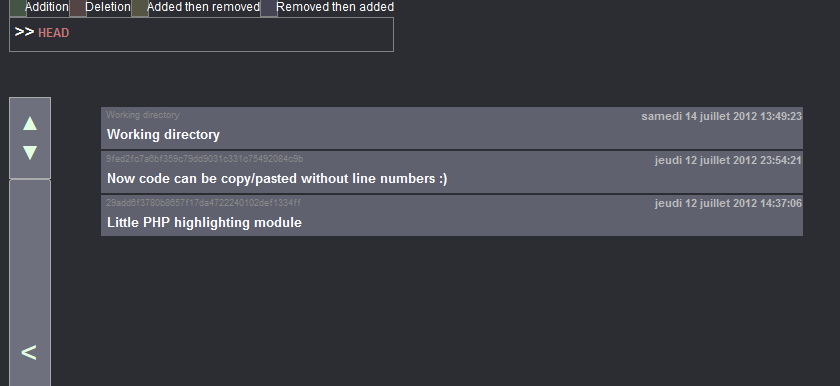
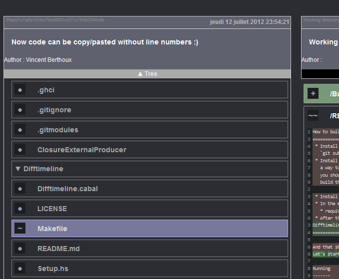
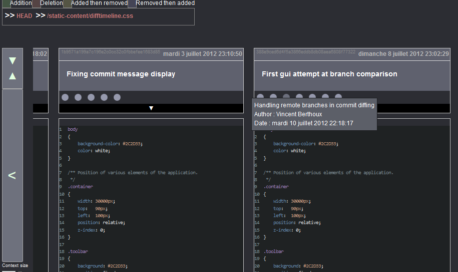
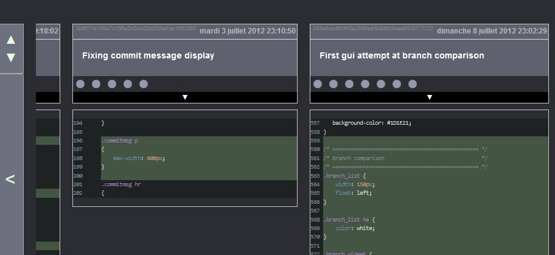
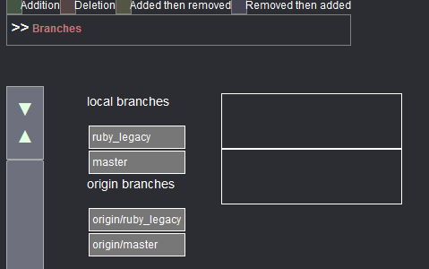

Difftimeline
============

Let's start easy :

    `$ difftimeline`

You can see the diff of the working directory from the HEAD. If you
click the huge button `<`, you can fetch previous commit from the
current head

If you click the button above `<` you can switch back and forth to the
"compact" view.

Navigating files
----------------
Clicking on the `Tree` panel will show you all the files contained
in the commit and let you browse them.

You can click on any to follow the history of a specific file, let's follow the `static-content/difftimeline.css`

You can see every modification of a file between two commits. In the commit description, each round represent a commit whom have not modified the file. If you click on any round, you will jump to the commit description. You can also use the compact mode

To directly see modifications for a file, you can use `$ difftimeline filename` at the command line.

Comparing branches
------------------
This part is still 'experimental', so expect changes in the future, and there is still rough edges. To let you compare branch, launch difftimeline the following way : `difftimeline compare`

You can then drag'n'drop branches in the square to compare them

Modification
------------
To modify/hack difftimeline, see the [Build.md](Build.md) file.